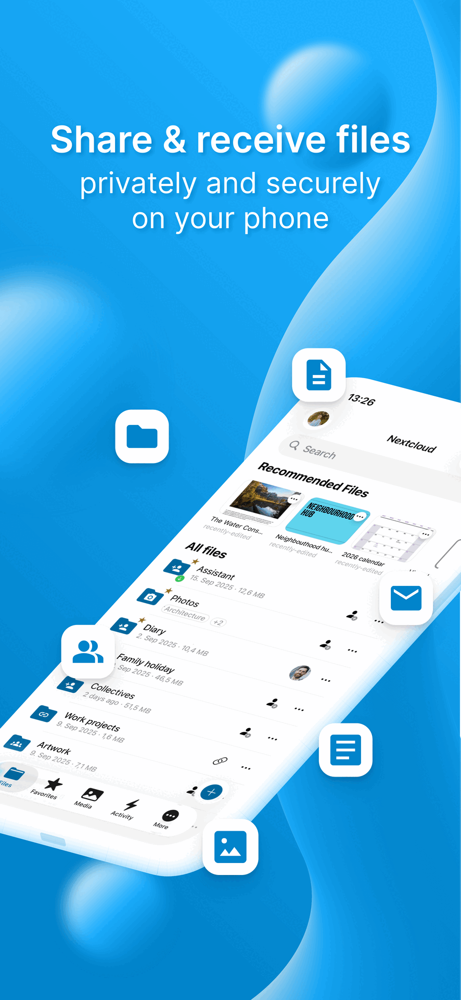

# Seventh Star iOS

An educational cloud storage application for South African students, based on the open source [Nextcloud iOS app](https://github.com/nextcloud/ios).



## About

Seventh Star iOS is a branded fork of Nextcloud, customized for South African students to access their educational materials, collaborate, and manage their academic files securely.

**Company:** Seventh Star (Pty) Ltd
**Website:** https://seventhstar.co.za
**Original Project:** [Nextcloud iOS](https://github.com/nextcloud/ios)
**License:** GPL v3 with App Store Exception

## Features

- ✅ Secure file synchronization
- ✅ Offline access to files
- ✅ Photo/video auto-upload
- ✅ Document viewing and editing
- ✅ Share files with classmates
- ✅ Integration with Seventh Star educational services
- ✅ End-to-end encryption
- ✅ South African data hosting

## For Students

Seventh Star helps Grade 10-12 students and university applicants succeed in:
- Mathematics
- Physical Science
- NBT preparation
- Medicine and Engineering entrance requirements

This app provides secure access to all your study materials, lecture notes, and collaborative projects.

## License

This app is licensed under **GPL v3 with an App Store exception**, which allows distribution through Apple's App Store while maintaining open source compliance.

See [LICENSE.txt](LICENSE.txt) and [ATTRIBUTION.md](ATTRIBUTION.md) for full details.

## Source Code

Full source code is available at: https://github.com/SeventhStar-Info/Next-Cloud-Instance

## Attribution

This application is built upon the excellent [Nextcloud iOS](https://github.com/nextcloud/ios) open source project.

**Original Work:**
- Copyright © 2017-2025 Nextcloud GmbH
- Created by Marino Faggiana and the Nextcloud community

**Seventh Star Modifications:**
- Copyright © 2025 Seventh Star (Pty) Ltd
- Branding, customization, and educational features

We are deeply grateful to the Nextcloud team and community for creating and maintaining this powerful platform.

## Changes from Upstream

This fork includes:
- Custom branding with Seventh Star colors (#C62828)
- Bundle identifier: za.co.seventhstar.ios
- Educational content integration
- South African localization
- Student-focused features

All core Nextcloud functionality is preserved and maintained.

## Building from Source

### Prerequisites

1. Xcode 16 or later
2. macOS 14.0 or later
3. Apple Developer account (for device deployment)

### Dependencies

You'll need a `GoogleService-Info.plist` file at the root directory for Firebase configuration. For development, use the [mock version](https://github.com/firebase/quickstart-ios/blob/master/mock-GoogleService-Info.plist).

### Build Steps

```bash
# Clone the repository
git clone https://github.com/SeventhStar-Info/Next-Cloud-Instance.git
cd Next-Cloud-Instance

# Checkout the branding branch
git checkout branding

# Open in Xcode
open Nextcloud.xcodeproj

# Build and run (Cmd+R)
```

## Syncing with Upstream

This fork regularly syncs with the upstream Nextcloud iOS repository to receive:
- Security updates
- Bug fixes
- New features
- Performance improvements

```bash
# Fetch latest from Nextcloud
git fetch upstream
git merge upstream/main
```

## Support

**Seventh Star Support:**
- Email: support@seventhstar.co.za
- Website: https://seventhstar.co.za

**Technical Issues:**
- Server/backend issues: Contact your Seventh Star administrator
- App issues: [Open an issue](https://github.com/SeventhStar-Info/Next-Cloud-Instance/issues)

**Nextcloud Community:**
- For general Nextcloud questions: https://help.nextcloud.com/c/clients/ios

## Contributing

We welcome contributions! This project follows the Nextcloud contribution guidelines:

1. Fork the repository
2. Create a feature branch
3. Make your changes
4. Add tests if applicable
5. Submit a pull request

Please read the [Code of Conduct](https://nextcloud.com/code-of-conduct/) before contributing.

### DCO Signoff

All commits must include a `Signed-off-by` line:

```bash
git commit -s -m "Your commit message"
```

## Privacy

Seventh Star respects student privacy:
- Data hosted in South Africa
- POPIA (Protection of Personal Information Act) compliant
- No tracking or analytics beyond what's necessary
- Transparent data handling

Privacy Policy: https://seventhstar.co.za/privacy
Terms of Service: https://seventhstar.co.za/terms

## Contact

**Seventh Star (Pty) Ltd**
Centurion, Gauteng, South Africa
Email: support@seventhstar.co.za
Website: https://seventhstar.co.za

Social Media:
- Instagram: @seventhstar.tuition
- Facebook: SeventhStarHoldings

---

**Built with ❤️ for South African students**

*Based on Nextcloud iOS - Copyright © 2017-2025 Nextcloud GmbH*
